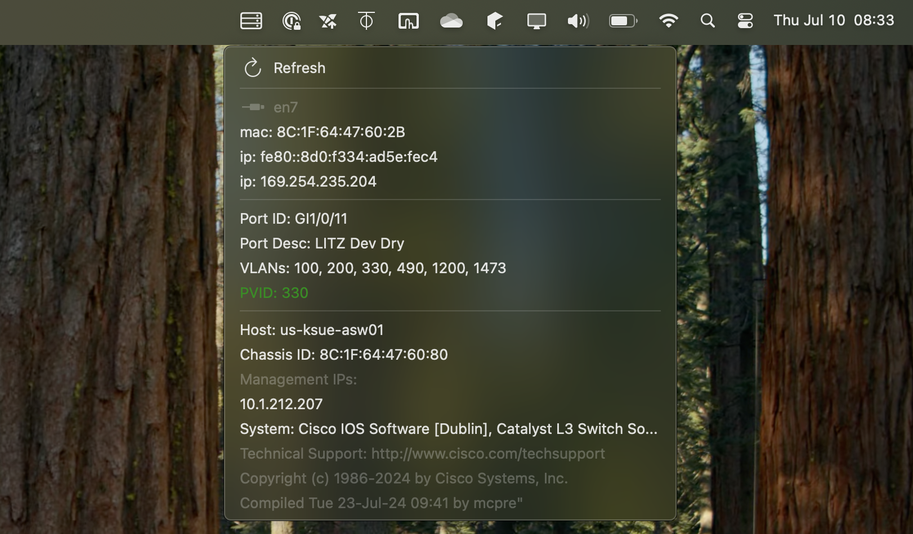

# lldp-bar
lldp plugin for SwiftBar

## Requirements
* [lldpd](https://github.com/lldpd/lldpd) - After being installed, lldpd runs as a daemon. LLDP data is collected on all interfaces. lldp-bar interacts with lldpd via lldpcli.
* [SwiftBar](https://github.com/swiftbar/SwiftBar) - SwiftBar makes it easy to schedule and run scripts right from the mac menubar.

## Installation
* Install lldpd and set it up to run as a daemon. The user running swiftbar will need to be in the `_lldpd` group to access the daemon. Installation can be tested by running `lldpcli show neighbors`.
* Copy `lldp.py` to the SwiftBar folder.  The path for `lldpcli` may need to be adjusted depending on where it is installed.