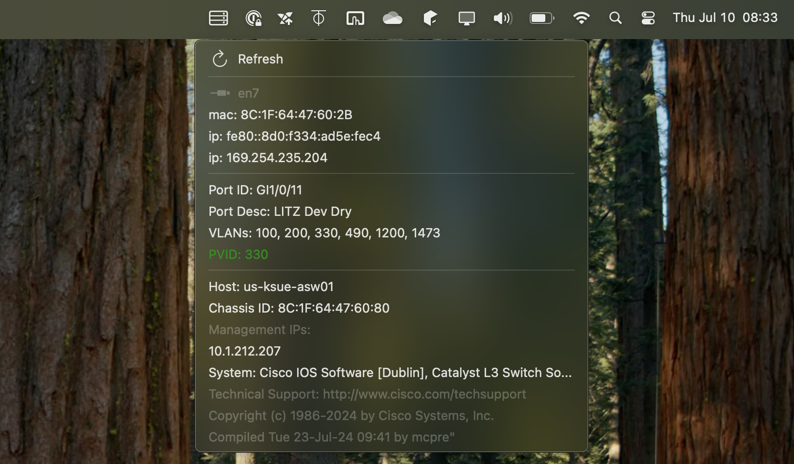

# lldp-bar
lldp plugin for SwiftBar



## Requirements
* [lldpd](https://github.com/lldpd/lldpd) - After being installed, lldpd runs as a daemon. LLDP data is collected on all interfaces. lldp-bar interacts with lldpd via lldpcli.
* [SwiftBar](https://github.com/swiftbar/SwiftBar) - SwiftBar makes it easy to schedule and run scripts right from the mac menubar.

## Recommended Installation
* Install the [Microsoft LLDP Enablement Package](https://www.microsoft.com/en-us/download/details.aspx?id=103383).  This package is signed and works out of the box with lldp-bar.
* Copy `lldp.py` to the SwiftBar folder.

## Other lldpd Sources
lldpd can be installed via brew or from the [lldpd project page](https://github.com/lldpd/lldpd). These other sources may require additional steps.

After installation, confirm that that your user has access to `lldpd`.

```sh
karl@litz-dev ~ % /usr/local/sbin/lldpcli show neighbors
2025-09-28T15:32:22 [WARN/control] unable to connect to socket /var/run/lldpd.socket: Permission denied
```

If unable to connect, add your user to the _lldpd group.
```sh
karl@litz-dev ~ % sudo dseditgroup -o edit -a karl -t user _lldpd
Password:
karl@litz-dev ~ % /usr/local/sbin/lldpcli show neighbors         
-------------------------------------------------------------------------------
LLDP neighbors:
-------------------------------------------------------------------------------
```
